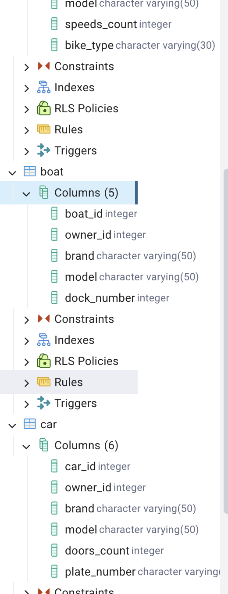
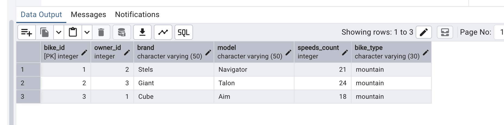
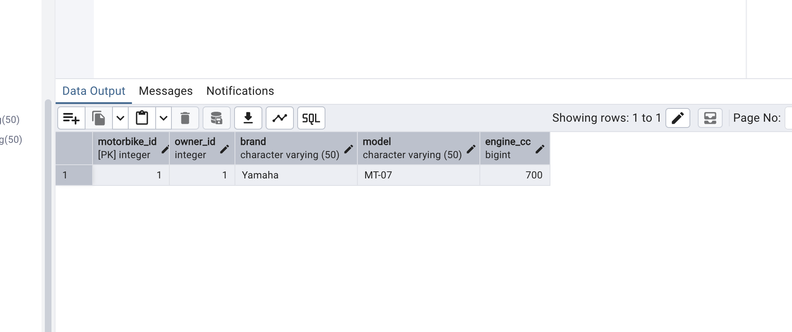
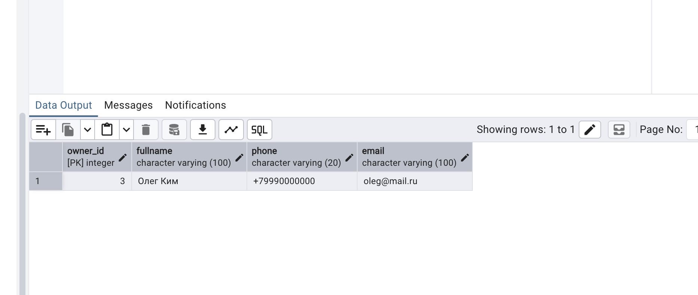

# HW2 — MultiGarage: SQL-скрипты и скриншоты

База `multigarage`, 6 таблиц: `owner, car, bike, motorbike, airplane, boat`.

## Файлы
- `01_create.sql` — создание таблиц по ER-диаграмме (PK через SERIAL, FK через REFERENCES на `owner`)
- `02_alter.sql` — 4 изменения структуры: ADD `plate_number` + UNIQUE (car), ADD `bike_type` + DEFAULT (bike), RENAME `berth_number` → `dock_number` (boat), смена типа `engine_cc` INT → BIGINT (motorbike)
- `03_insert.sql` — по 3 тестовые записи в каждую таблицу (сначала `owner`, потом остальные с `owner_id` 1–3)
- `04_update.sql` — 4 изменения данных через UPDATE ... WHERE

## Скриншоты (pgAdmin, база multigarage)

### Структура после ALTER
Видно новые колонки `bike_type`, `dock_number`, `plate_number`:

### Данные после INSERT (таблица bike, 3 строки)

### Проверка UPDATE + смена типа (motorbike: engine_cc bigint = 700)

### Проверка UPDATE (owner: новый телефон +79990000000)

